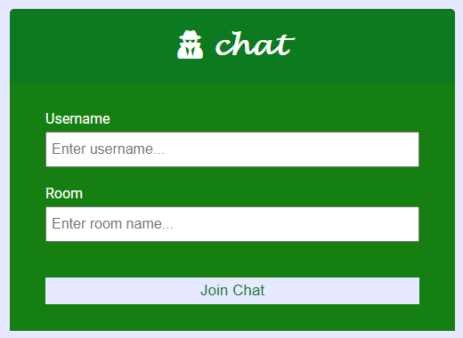
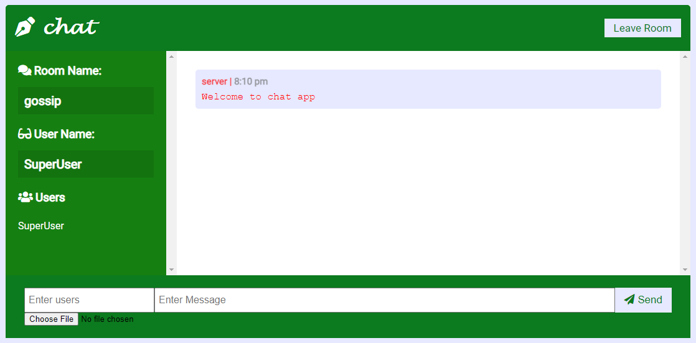

# chat-A-chat-application
A chat application using socket.io and express.js.

### Tools-Used
* Node.js
* socket.io
* express.js

### Features
* Room based
* Multicast,Unicast Support inside chat room [users should be ',' separated](e.g. [one,two] or [one] or[one,two,three,...,...,...] etc)
* Join any room using room name
* Image sending support

### UI PREVIEW
###### Login Page

###### UI Page

